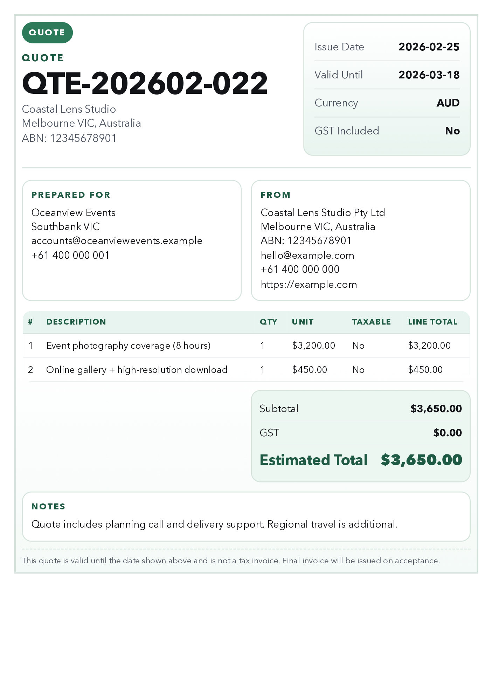
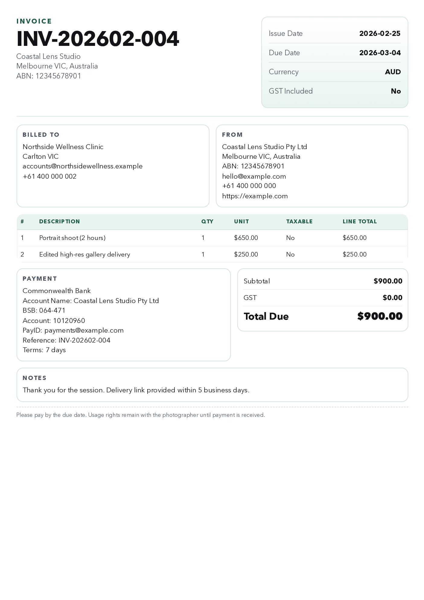

# Invoice Flow CLI - Australian Invoice & Quote Generator

Invoice Flow CLI is an agent-friendly tool for generating professional **Australian invoices and quotes** as PDF files.
It validates GST and ABN rules, supports JSON and plain text input, and outputs machine-readable artifacts for automation.

## Why Use Invoice Flow CLI

- Generate polished invoice and quote PDFs from CLI commands.
- Validate AU-specific invoicing fields (Invoice vs Tax Invoice behavior).
- Keep automation-friendly outputs: `invoice.*` or `quote.*` (PDF + normalized JSON + validation JSON).
- Use strict JSON schema (recommended) or simple plain text input.
- Built for freelancers, studios, and small businesses that need repeatable invoicing workflows.

## Preview

### Generic Quote Example



### Generic Invoice Example



## Install

```bash
npm install
npx playwright install chromium
npm run build
```

## Quick Start

### Generate an Invoice

```bash
npm run generate -- --input ./samples/invoice.sample.json --profile ./profiles/business.profile.example.json --out ./output
```

### Generate a Quote

```bash
npm run quote -- --input ./samples/quote.sample.json --profile ./profiles/business.profile.example.json --out ./output
```

### Validate Only

```bash
npm run validate -- --input ./samples/invoice.sample.json --profile ./profiles/business.profile.example.json
```

### HTML Preview

```bash
npm run preview -- --input ./samples/quote.sample.json --profile ./profiles/business.profile.example.json --out ./output --type quote
```

## Plain Text Input Example

```text
client: Oceanview Events
client email: accounts@oceanviewevents.example
issue date: 2026-02-25
due date: 2026-03-04
type: invoice
gst: false
- Event photography coverage (4 hours) | 1 | 650 | false
- Edited high-res gallery delivery | 1 | 250 | false
notes: Thanks for booking this session.
```

## Schemas

- `schemas/invoice.schema.v1.json`
- `schemas/profile.schema.v1.json`

## Compliance Behavior

- Label defaults to `Invoice`.
- Label becomes `Tax Invoice` only when `gstEnabled=true`.
- Quote mode uses label `Quote` and displays quote validity date.
- GST mode checks seller ABN presence and recipient requirements for totals >= AUD 1,000.
- ABN format checksum warnings are included in validation results.

## Privacy Defaults

- Private/local business data files are gitignored by default:
  - `profiles/business.profile.json`
  - `profiles/client.presets.json`
- Local branding assets are gitignored.
- Tracked sample data is generic placeholder content only.

## Notes

- This tool is not legal advice. Confirm invoicing obligations with the ATO.
- Start from `profiles/business.profile.example.json` and create your private local profile.
- Codex skill bundle is included at `skills/invoice-flow/`.
